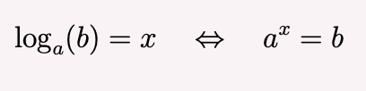
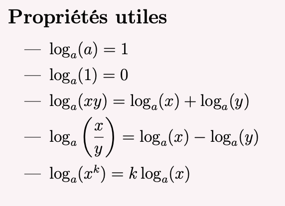

# Assignment 

Write a program in any of the following languages:
- rust, 
- golang, 
- c++ 
- c 

# Notion

Given 2 positive real numbers a and b, with a ≠ 1. Le logarithm with base a of b is the number x such as :

# Tasks:

## Task 1 
- Determine a function that will accept two parameters:
- a
- b 

- That function will output/return the value of x

## Task 2

- Make sure the function handles these scenarios:

## Forbidden 

You cannot make use of any library that will render that task too easy to pull off

## Definition of Done

- the program works perfectly after being tested out several times (I want to see the tests and results)

- Every and any choice made in the program (value type,keywords,local variables) must be documented and commented

P.S: Do not rush into using ai's for, tomorrow  you will have to write exactly the same code with no computer or help but your memory.
 
